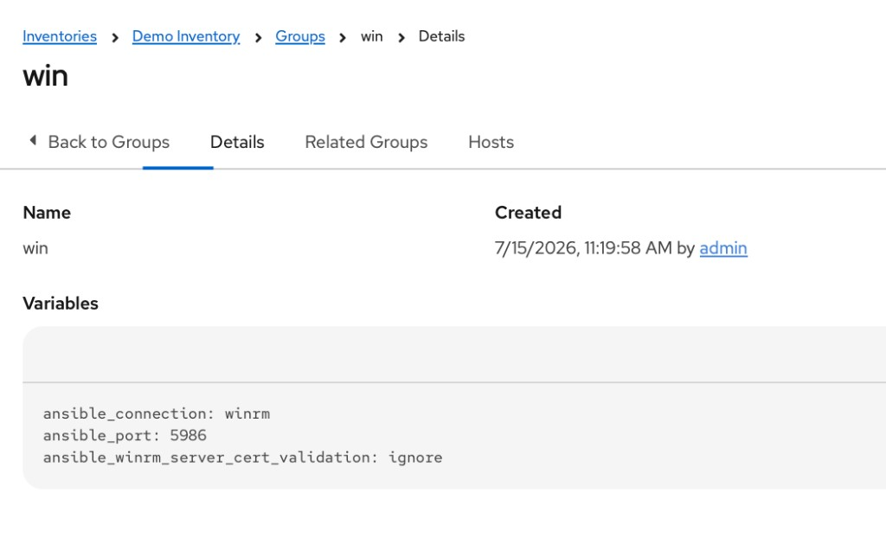
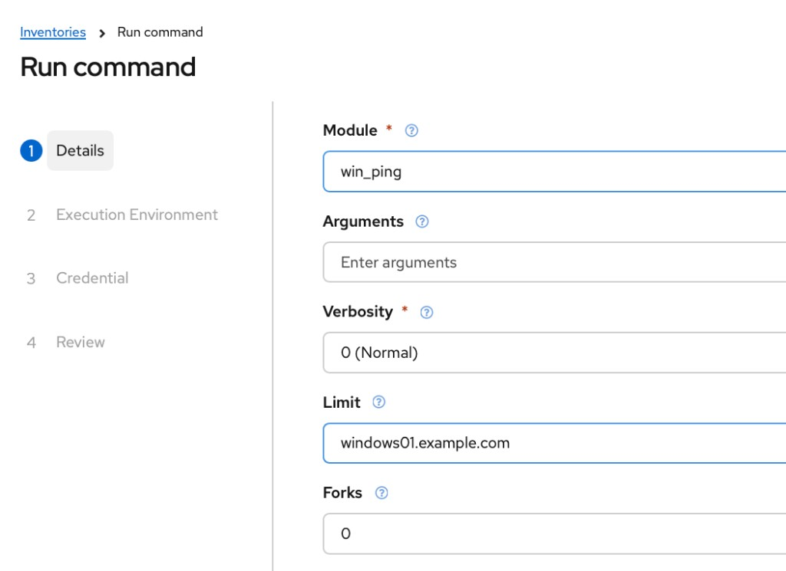

# Windows Automation Setup

This repository uses Ansible Automation Platform (AAP) to automate Windows hosts over **WinRM HTTPS**.

Windows hosts must be reachable on TCP `5986`, configured for Ansible remoting, and assigned to an AAP inventory group with the required WinRM connection variables.

## Requirements

Before running Windows automation:

* Allow TCP `5986` from the AAP execution environment to the Windows hosts.
* Configure WinRM on each Windows host.
* Add the Windows hosts to an AAP inventory group named `win`.
* Configure the required WinRM variables on the `win` group.
* Attach a Windows Machine credential to the AAP Job Template or ad hoc command.

## 1. Allow TCP Port 5986

Ansible connects to the Windows hosts using **WinRM over HTTPS**.

Ensure TCP port `5986` is allowed between the AAP execution environment and the Windows hosts.

| Protocol | Port | Purpose          |
| -------- | ---- | ---------------- |
| TCP      | 5986 | WinRM over HTTPS |

> Only allow TCP `5986` from trusted automation or management networks whenever possible.

## 2. Configure WinRM on the Windows Host

Ansible provides a PowerShell helper script to configure Windows Remote Management for Ansible connectivity.

Open **PowerShell as Administrator** on the Windows host and run:

```powershell
$scriptUrl = "https://github.com/ansible/ansible/raw/stable-2.9/examples/scripts/ConfigureRemotingForAnsible.ps1"
$scriptPath = "$env:TEMP\ConfigureRemotingForAnsible.ps1"

Invoke-WebRequest -Uri $scriptUrl -OutFile $scriptPath
powershell.exe -ExecutionPolicy Bypass -File $scriptPath -Verbose
```

> Review remote scripts before executing them, particularly on production systems.

### Expected Result

The script should complete successfully and configure Windows Remote Management for Ansible connectivity.

Verify the WinRM listener:

```powershell
winrm enumerate winrm/config/listener
```

Confirm that an HTTPS listener is configured on port `5986`.

## 3. Configure the AAP Inventory

In AAP, add the Windows hosts to an inventory and create a group named:

```text
win
```

Add all Windows hosts targeted by this automation to the `win` group.

The inventory should conceptually look like:

```text
Inventory
└── win
    ├── windows01.example.com
    ├── windows02.example.com
    └── windows03.example.com
```

### Configure the `win` Group Variables

In the AAP inventory, select:

**Groups → win → Variables**

Add:

```yaml
---
ansible_connection: winrm
ansible_port: 5986
ansible_winrm_server_cert_validation: ignore
```

These variables configure hosts in the `win` group to connect using WinRM over HTTPS on TCP `5986`.

> `ansible_winrm_server_cert_validation: ignore` disables validation of the WinRM HTTPS certificate and is commonly used with self-signed certificates. Environments using certificates issued by a trusted CA should consider enabling certificate validation.



## 4. Configure Windows Credentials

Create or select an AAP **Machine credential** containing the Windows username and password used to connect to the target hosts.

Attach the credential when running the automation.

Do not store Windows credentials in:

* Inventory variables
* Playbooks
* Repository files

Use AAP credentials to manage connection secrets.

## 5. Verify Connectivity with an AAP Ad Hoc Command

Before running the automation, verify connectivity directly from the AAP inventory.

Select the `win` group and choose **Run Command**.

Run the Windows win_ping module:

```text
ansible.windows.win_ping
```



Select the Windows Machine credential and the appropriate Execution Environment.

A successful result returns:

```text
SUCCESS => {
    "changed": false,
    "ping": "pong"
}
```

If the hosts return `pong`, AAP can connect to the Windows hosts over WinRM.

## Execution Environment

The AAP Execution Environment used for Windows automation must include the Python dependency required by the WinRM connection plugin.

For `ansible_connection: winrm`, ensure the Execution Environment includes:

```text
pywinrm
```

If WinRM connection errors occur across all Windows hosts, verify the contents of the Execution Environment before troubleshooting individual servers.

## Troubleshooting

### TCP 5986 Is Not Reachable

Verify network connectivity to the Windows host:

```powershell
Test-NetConnection <windows-host> -Port 5986
```

Check firewalls, network ACLs, and other network security controls between the AAP execution environment and the Windows host.

### WinRM HTTPS Listener Is Missing

On the Windows host, run:

```powershell
winrm enumerate winrm/config/listener
```

Confirm that an HTTPS listener is configured on port `5986`.

If the listener is missing, rerun the WinRM configuration script from an elevated PowerShell session.

### PowerShell Blocks the Configuration Script

Run the script with an execution policy override:

```powershell
powershell.exe -ExecutionPolicy Bypass -File $scriptPath -Verbose
```

The override applies to the PowerShell process used to execute the script.

### Windows Network Profile Is Public

The WinRM configuration script can fail when the Windows network profile is set to `Public`.

Check the current network profile:

```powershell
Get-NetConnectionProfile
```

If the applicable interface is using a `Public` network category, review the server's network configuration and, where appropriate, change it to `Private`:

```powershell
Set-NetConnectionProfile -InterfaceIndex <interface-index> -NetworkCategory Private
```

Rerun the WinRM configuration script after correcting the network profile.

> Confirm the appropriate network category with your Windows and network security standards before making this change.

### AAP Cannot Authenticate

Verify that:

* The correct Machine credential is selected.
* The Windows username and password are valid.
* The account has the required access to the Windows host.
* The host is assigned to the `win` inventory group.
* The WinRM variables are configured on the `win` group.

### All Windows Hosts Fail with WinRM Errors

If all hosts fail with similar WinRM connection or Python dependency errors, verify that the selected AAP Execution Environment includes `pywinrm`.

## Quick Setup Checklist

* [ ] Allow TCP `5986` from the AAP execution environment to the Windows hosts
* [ ] Run the WinRM configuration script as Administrator
* [ ] Verify the WinRM HTTPS listener
* [ ] Create the `win` group in the AAP inventory
* [ ] Add Windows hosts to the `win` group
* [ ] Add the WinRM variables to the `win` group
* [ ] Configure a Windows Machine credential in AAP
* [ ] Verify the Execution Environment includes `pywinrm`
* [ ] Run `ansible.windows.win_ping` as an AAP ad hoc command

## Reference

Ansible WinRM configuration script:

https://github.com/ansible/ansible/blob/stable-2.9/examples/scripts/ConfigureRemotingForAnsible.ps1
